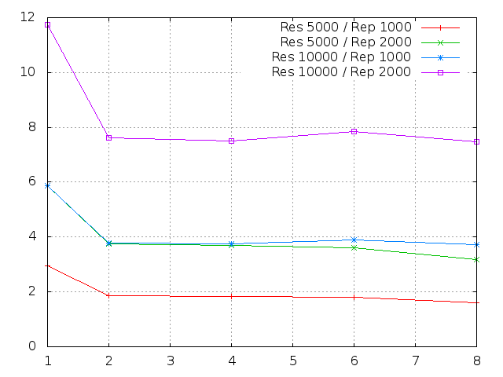

Nome: Leonardo Marcuzzo\
Matrícula: 201130409\
E-mail: lmarcuzzo@inf.ufsm.br

## Questões Pthreads

**1. Explique como se encontram implementadas as 4 etapas de projeto: particionamento, comunicação, aglomeração, mapeamento (use trechos de código para ilustrar a explicação).**

O particionamento é feito na função dotprod_worker, onde ele recebe um argumento que define o offset, isto é, aonde uma thread vai começar a calcular.

	void *dotprod_worker(void *arg)
	{
   		int i, k;
   		long offset = (long) arg;

A parte de comunicação é feita através das variáveis globais ***dotdata*** e ***mutexsum***.
A variável ***dotdata*** é uma struct que contém os dois vetores e a soma dos valores que são compartilhados entre as threads.
A variável ***mutexsum*** serve para garantir que apenas uma thread esteja usando a variável no momento.

A parte de aglomeração é feita na função ***pthread_create***, que divide igualmente o vetor entre o número de threads.

    for (i = 0; i < nthreads; i++) {
        pthread_create(&threads[i], &attr, dotprod_worker, (void *) i);
    }

Finalmente, a parte de mapeamento é feita através da variável nthreads, onde o usuário define quantas threads serão usadas para resolver o problema e o valor é passado para a função ***dotprod_threads***.

    nthreads = atoi(argv[1]);
    dotprod_threads(nthreads);

**2. Considerando o tempo (em segundos) mostrado na saída do programa, qual foi a aceleração com o uso de threads?**

Os resultados obtidos foram:
```
./pthreads_dotprod 1 1000000 2000
10000.000000
1 thread(s), 11727456 usec
```

```
./pthreads_dotprod 2 500000 2000
10000.000000
2 thread(s), 7416776 usec
```

A diferença foi um ganho de 4310680 usec, pouco mais de 4 segundos.
O **speedup** foi de **1.58** e a **eficiência** de **0.79** para duas threads.

**3. A aceleração (speedup) se sustenta para outros tamanhos de vetores, números de threads e repetições? Para responder a essa questão, você terá que realizar diversas execuções, variando o tamanho do problema (tamanho dos vetores e número de repetições) e o número de threads (1, 2, 4, 8..., dependendo do número de núcleos). Cada caso deve ser executado várias vezes, para depois calcular-se um tempo de processamento médio para cada caso. Atenção aos fatores que podem interferir na confiabilidade da medição: uso compartilhado do computador, tempos muito pequenos, etc.**

No caso do meu notebook, que possui dois cores, a resposta é não, como se pode ver no gráfico que está na proxima questão, o speedup pode ser percebido apenas quando se passa de uma thread para duas. O speedup quando se faz com 4, 6 ou 8 threads é mínimo, e em alguns casos até aumenta o tempo.


**4. Elabore um gráfico/tabela de aceleração a partir dos dados obtidos no exercício anterior.**



**5. Explique as diferenças entre [pthreads_dotprod.c](pthreads_dotprod/pthreads_dotprod.c) e [pthreads_dotprod2.c](pthreads_dotprod/pthreads_dotprod2.c). Com as linhas removidas, o programa está correto?**

Não, as linhas removidas servem para dar lock na variável e garantir que apenas uma thread esteja usando a variável no momento. Sem isso, é possível que outra thread use a variável enquanto ela já esta sendo usada, o que pode ocasionar erros.