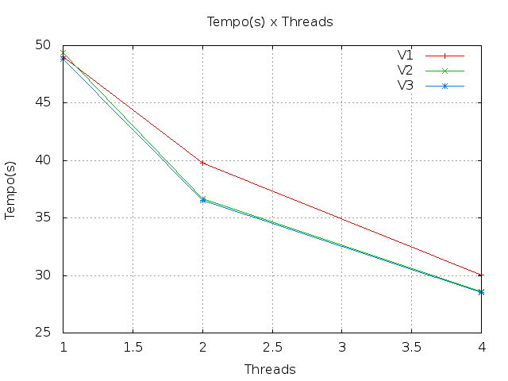
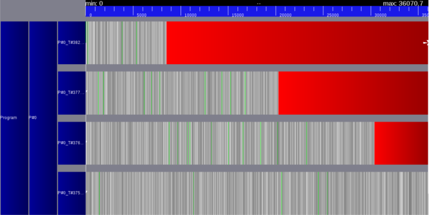
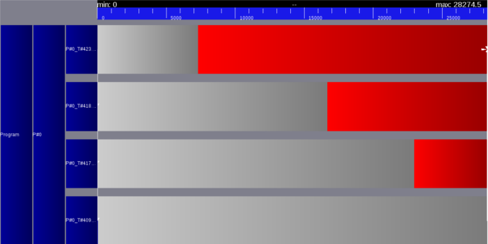

# ELC 139 - Programaçao Paralela

Nome: Leonardo Marcuzzo

O código desenvolvido está em [primes_openmp.c](primes_openmp.c)

## **Comparação**

### **Tempo(s)**

| Threads  | V1 | V2 | V3 |
| ------------- | ------------- | ------------- | ------------- |
| 1 | 49.054691 | 49.386178 | 48.806396 |
| 2 | 39.800839 | 36.686750 | 36.503800 |
| 4 | 30.044317 | 28.579369 | 28.506239 |

### **Speedup**

| Threads  | V1 | V2 | V3 |
| ------------- | ------------- | ------------- | ------------- |
| 2 | 1.23241206 | 1.3461584 | 1.3370223 |
| 4 | 1.63274442 | 1.7280359 | 1.7121303 |

### **Eficiência**

| Threads  | V1 | V2 | V3 |
| ------------- | ------------- | ------------- | ------------- |
| 2 | 61,6% | 67,3% | 66,8% |
| 4 | 40,8% | 43,2% | 42,8% |

## **Execução**

### **V1**

### **V2**

### **V3**

## **Diferenças**

A função **v1** compartilha o valor **n** e o valor **total**, o que causa um excesso de comunicação entre as threads, como pode ser visto na execução. Além disso a variável total deve ser definida como atomic, para que apenas uma thread possa usar ela a cada momento.

A função **v2** compartilha apenas o valor de **n**, o que deveria dividir igualmente o trabalho entre as threads. Mesmo assim, as threads ficam bloqueadas porque acho que o trabalho não está sendo dividido igualmente entre elas.

A função **v3** também deveria distribuir igualmente o trabalho entre as threads e após isso somar o resultado na variável **total**, mas por algum motivo as threads também ficam bloqueadas.

### **Referências**
[OpenMP](https://computing.llnl.gov/tutorials/openMP)

[Count Primes Using OpenMP ](https://people.sc.fsu.edu/~jburkardt/c_src/prime_openmp/prime_openmp.html)

[Parallel processing a prime finder with openMP](http://stackoverflow.com/questions/19872434/parallel-processing-a-prime-finder-with-openmp)

