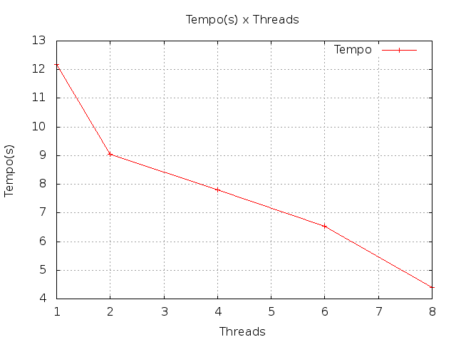
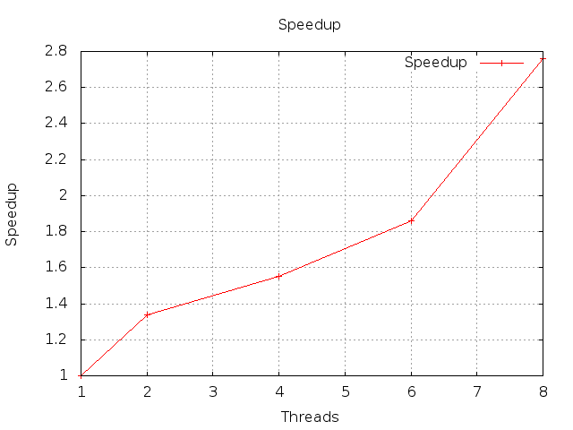

# ELC 139 - Programaçao Paralela

Nome: Leonardo Marcuzzo

O código desenvolvido está em [ray_mpi.cpp](ray_mpi.cpp)

## **Comparação**

### **Tempo(s)**

| Threads  | Tempo(s) |
| ------------- | ------------- |
| 1 | 12.17|
| 2 | 9.04 |
| 4 | 7.81 |
| 6 | 6.54 |
| 8 | 4.40 |

### **Speedup**

| Threads  | Speedup |
| ------------- | ------------- |
| 2 | 1.34 |
| 4 | 1.55 |
| 6 | 1.86 |
| 8 | 2.76 | 

### **Eficiência**

| Threads  | Eficiencia |
| ------------- | ------------- |
| 2 | 67% | 
| 4 | 38% |
| 6 | 31% |
| 8 | 34% |

## **Execução**
Apesar do speedup com 8 threads ser de quase 3, sua eficiencia e apenas um pouco mais alta que 4 ou 6 threads. Mesmo assim todos os testes apresentaram resultados melhores que o sequencial